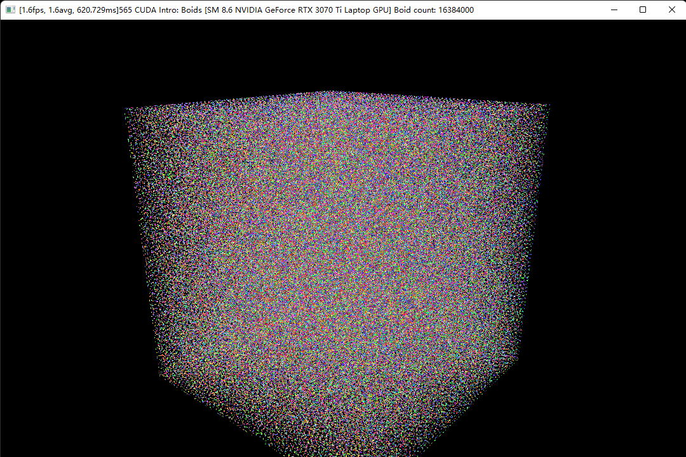

**Project  - Cuda Flocking**

* Tested on personal laptop:
  - Windows 11
  - i7-12700 @ 4.90GHz with 16GB RAM
  - RTX 4070 Ti Laptop 12GB

256K particles

70 fps with 2M particles. Real time!

Even 16384000 particles it bares!

